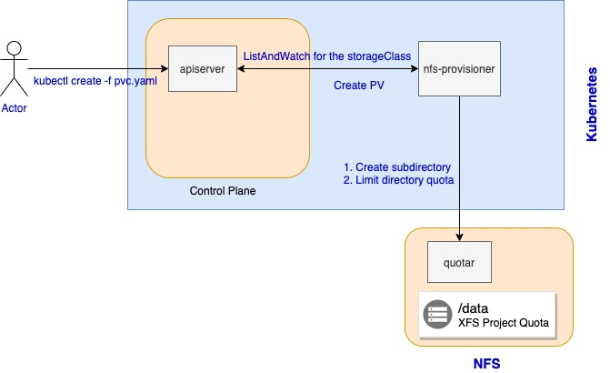

# quotar

Quotar is the agent to create subdiretory and configure quota for it base on xfs system.




## Deployment

### 1. bind disk using xfs project quotas


```console
$ lsblk
NAME   MAJ:MIN RM  SIZE RO TYPE MOUNTPOINT
vda    253:0    0   40G  0 disk
└─vda1 253:1    0   40G  0 part /
vdb    253:16   0  300G  0 disk
$ mkfs.xfs /dev/vdb
meta-data=/dev/vdb              isize=512    agcount=4, agsize=6553600 blks
         =                       sectsz=512   attr=2, projid32bit=1
         =                       crc=1        finobt=0, sparse=0
data     =                       bsize=4096   blocks=26214400, imaxpct=25
         =                       sunit=0      swidth=0 blks
naming   =version 2              bsize=4096   ascii-ci=0 ftype=1
log      =internal log           bsize=4096   blocks=12800, version=2
         =                       sectsz=512   sunit=0 blks, lazy-count=1
realtime =none                   extsz=4096   blocks=0, rtextents=0
$ mount -o prjquota  /dev/vdb /home
```

Due to configuration will fail after operation system restart, so we will add setting to `/etc/fstab`

```console
echo '/dev/vdb /home xfs defaults,prjquota 0 0' >> /etc/fstab
```


### 2. install nfs and export /home directory

```bash
yum -y install nfs-utils rpcbind
chmod 755 /home
echo '/data/k8s  *(rw,sync,no_root_squash)' >> /etc/exports
systemctl start rpcbind.service
systemctl enable rpcbind
systemctl status rpcbind
systemctl start nfs.service
systemctl enable nfs
systemctl status nfs
```

### 3. start up quotar

```bash
# download quotar binary file
curl -L -O https://github.com/Wang-Kai/quotar/releases/download/v0.1.8/quotar_0.1.8_linux_amd64.tar.gz
tar -xf quotar_0.1.8_linux_amd64.tar.gz
mv quotar /bin/
rm -fr quotar_0.1.8_linux_amd64.tar.gz


cat > /etc/systemd/system/quotar.service <<EOF
[Unit]
Description=Quotar Service
After=network.target

[Service]
Type=simple
Restart=always
RestartSec=1
ExecStart=/bin/quotar

[Install]
WantedBy=multi-user.target
EOF

systemctl daemon-reload
systemctl start quotar
systemctl status quotar
```

### 4. install nfs-provisioner Helm Chart


```console
cd deploy/helm-chart
helm install nfs-quotar -n MY_NAMESPACE ./deploy/helm-chart
```